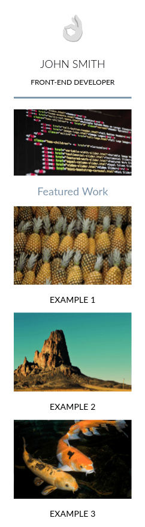
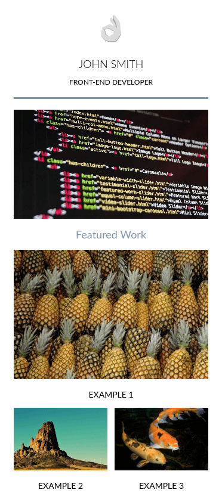
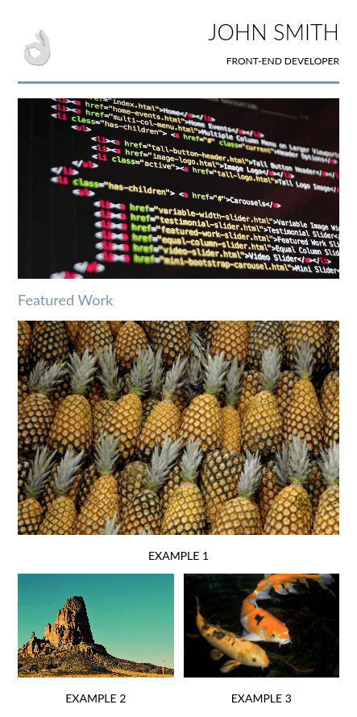
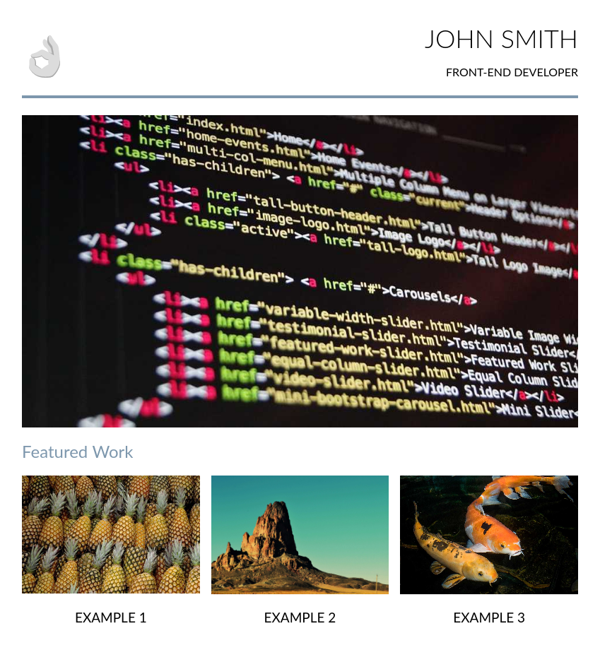
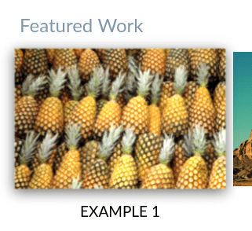

# Responsive Portfolio Demo

An example responsive portfolio site using a flexbox grid for layout. With thanks to [Udacity](https://udacity.com) for original inspiration.

## Layouts

### Stacked

### Semi Stacked Centered (viewport ≥ 350px)

### Semi Stacked (viewport ≥ 500px)

### Natural Grid (viewport ≥ 600px)

## Hover Effects

